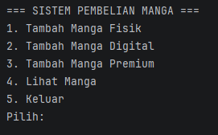
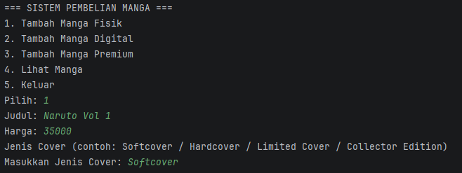
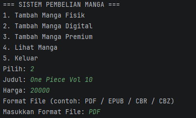
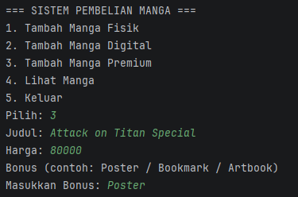
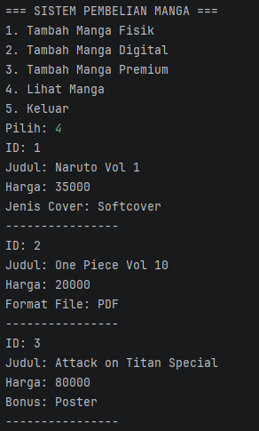

# Posttest 3
## Sistem Pembelian Manga

### Deskripsi Program
Program ini merupakan pengembangan dari Posttest sebelumnya dengan menerapkan konsep **Inheritance** pada bahasa pemrograman Java.

Inheritance digunakan untuk membuat hubungan antara superclass dan subclass sehingga kode lebih terstruktur dan dapat digunakan kembali.

---

### Konsep OOP Yang Digunakan
Pada program ini digunakan beberapa konsep Pemrograman Berorientasi Objek (OOP):

- Class dan Object
- Encapsulation
- Getter dan Setter
- Inheritance
- ArrayList

---

### Konsep Inheritance

Superclass:
- Manga

Subclass:
- MangaFisik
- MangaDigital
- MangaPremium

Tipe inheritance yang digunakan adalah **Hierarchical Inheritance**, yaitu satu superclass memiliki lebih dari satu subclass.

Relasi inheritance yang digunakan:

- MangaFisik **is a** Manga
- MangaDigital **is a** Manga
- MangaPremium **is a** Manga

---

### Penjelasan Class

#### 1 Manga (Superclass)
Class Manga merupakan class utama yang menyimpan atribut dasar dari manga seperti:

- id
- judul
- harga

Class ini menjadi superclass yang diwarisi oleh subclass lainnya.

---

#### 2 MangaFisik
MangaFisik merupakan manga yang dijual dalam bentuk **buku fisik**.

Karena berbentuk buku, manga fisik memiliki atribut tambahan yaitu **jenisCover**.

Contoh jenis cover:
- Softcover
- Hardcover
- Limited Cover
- Collector Edition

---

#### 3 MangaDigital
MangaDigital merupakan manga yang dijual dalam bentuk **file digital**.

Manga digital memiliki atribut tambahan yaitu **formatFile**.

Contoh format file:
- PDF
- EPUB
- CBR
- CBZ

---

#### 4 MangaPremium
MangaPremium merupakan manga edisi khusus yang memiliki **bonus tambahan**.

Contoh bonus:
- Poster
- Bookmark
- Artbook

---

### Fitur Program

Program memiliki beberapa fitur:

1. Menambahkan manga fisik
2. Menambahkan manga digital
3. Menambahkan manga premium
4. Melihat daftar manga

ID manga dibuat **otomatis (auto increment)** sehingga pengguna tidak perlu memasukkan ID secara manual.

---

### Tampilan Program

#### Menu Utama

#### Tambah Manga Fisik

#### Tambah Manga Digital

#### Tambah Manga Premium

#### Daftar Manga

---

### Kesimpulan
Dengan menerapkan konsep inheritance, class yang memiliki kesamaan atribut dapat diwariskan dari superclass sehingga kode program menjadi lebih rapi, terstruktur, dan mudah dikembangkan.