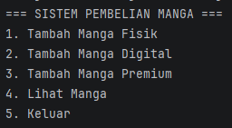
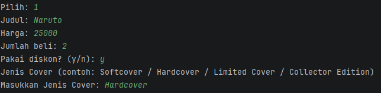
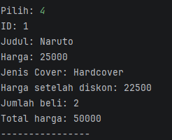

# Sistem Pembelian Manga (Posttest 4 - Polymorphism)

## Identitas

* Nama: M. Rafii Zaidan S.
* NIM: 2409106095
* Kelas: C2

---

## Deskripsi Program

Program ini merupakan pengembangan dari posttest sebelumnya dengan menerapkan konsep **Object Oriented Programming (OOP)**, khususnya **Polymorphism**.

Sistem ini digunakan untuk mengelola pembelian manga dengan beberapa jenis:

* Manga Fisik
* Manga Digital
* Manga Premium

Program memungkinkan pengguna untuk:

* Menambahkan data manga
* Melihat daftar manga
* Menghitung harga dengan diskon
* Menghitung total pembelian

---

## Konsep OOP yang Digunakan

### 1. Encapsulation

Data pada class `Manga` dibuat private dan diakses melalui getter:

* `getId()`
* `getJudul()`
* `getHarga()`

---

### 2. Inheritance

Class turunan dari `Manga`:

* `MangaFisik`
* `MangaDigital`
* `MangaPremium`

---

### 3. Polymorphism

#### Method Overloading (Static Polymorphism)

Terdapat beberapa method dengan nama sama pada class `Manga`:

* `tampilInfo()`
* `tampilInfo(boolean diskon)`
* `tampilInfo(int jumlah)`

Fungsi:

* Menampilkan info biasa
* Menampilkan harga setelah diskon 10%
* Menampilkan total harga berdasarkan jumlah pembelian

---

#### Method Overriding (Dynamic Polymorphism)

Method `tampilInfo()` dioverride pada:

* `MangaFisik` → menampilkan jenis cover
* `MangaDigital` → menampilkan format file
* `MangaPremium` → menampilkan bonus

---

## Cara Menjalankan Program

### Compile

javac mangastore/*.java

### Run

java mangastore.Main

---

## Dokumentasi Program

### Menu Utama

### Tambah Data

### Tampil Data

---

## Contoh Output

ID: 1
Judul: Naruto
Harga: 50000
Jenis Cover: Hardcover

Harga setelah diskon: 45000
Jumlah beli: 2
Total harga: 100000

---

## Kesimpulan

Program ini berhasil menerapkan:

* Encapsulation
* Inheritance
* Polymorphism (Overloading & Overriding)

Sehingga program menjadi lebih fleksibel dan modular.

---
