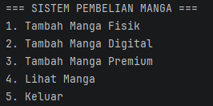
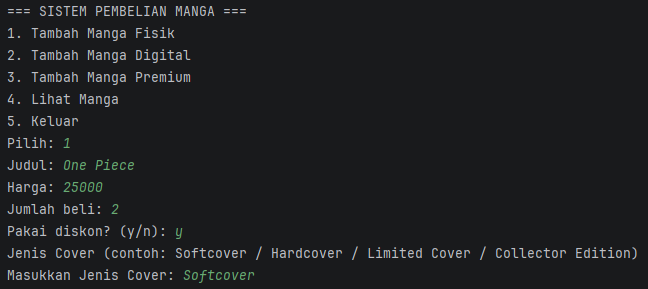
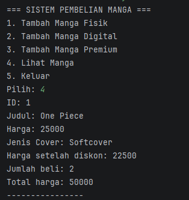

# Sistem Pembelian Manga (Posttest 5 - Abstraction)

## Identitas

* Nama: Muhammad Rafii Zaidan Sakaria
* NIM: 2409106095
* Kelas: C1

---

## Deskripsi Program

Program ini merupakan pengembangan dari posttest sebelumnya dengan menerapkan konsep **Object Oriented Programming (OOP)**, khususnya **Abstraction**.

Sistem ini digunakan untuk mengelola pembelian manga dengan beberapa jenis:

* Manga Fisik
* Manga Digital
* Manga Premium

Program memungkinkan pengguna untuk:

* Menambahkan data manga
* Melihat daftar manga
* Menghitung harga dengan diskon
* Menghitung total pembelian

---

## Konsep OOP yang Digunakan

### 1. Abstract Class

Class `Manga` diubah menjadi abstract class sehingga tidak dapat dibuat objek secara langsung.

Abstract class digunakan sebagai parent untuk:

* `MangaFisik`
* `MangaDigital`
* `MangaPremium`

---

### 2. Abstract Method

Pada class `Manga` terdapat method abstract:

```java
public abstract void tampilInfoLengkap();
```

Fungsi:

* Memaksa setiap class turunan untuk mengimplementasikan method tersebut
* Menjamin setiap jenis manga memiliki cara menampilkan informasi lengkap masing-masing

---

### 3. Interface

Dibuat interface `Diskonable` sebagai kontrak untuk fitur diskon.

```java
public interface Diskonable {
    void hitungDiskon();
    void tampilDiskon();
}
```

Fungsi:

* Menyediakan aturan method yang harus dimiliki class
* Digunakan untuk fitur perhitungan diskon

---

### 4. Implementasi Interface

Class yang mengimplementasikan interface:

* `MangaFisik`
* `MangaDigital`
* `MangaPremium`

Menggunakan:

```java
implements Diskonable
```

Fungsi:

* Menghitung harga setelah diskon
* Menampilkan harga diskon jika ada

---

## Cara Menjalankan Program

### Compile

javac mangastore/*.java

### Run

java mangastore.Main

---

## Dokumentasi Program

### Menu Utama



### Tambah Data



### Tampil Data



---

## Contoh Output

ID: 1
Judul: One Piece

Harga: 60000

Jenis Cover: Hardcover

---

Harga setelah diskon: 54000

Jumlah beli: 2

Total harga: 120000

---

## Kesimpulan

Program ini berhasil menerapkan:

* Abstract Class
* Abstract Method
* Interface

Sehingga program menjadi lebih terstruktur, modular, dan sesuai dengan konsep Abstraction dalam OOP.
