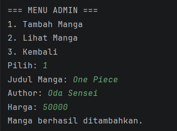
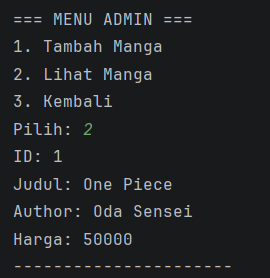
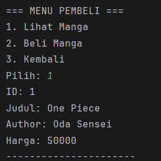
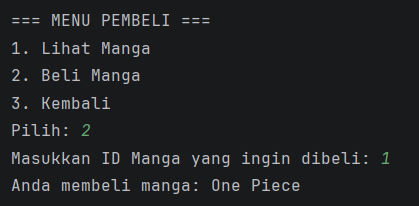

# Posttest 2
## Sistem Pembelian Manga

### Deskripsi Program
Program ini merupakan pengembangan dari Posttest 1 yang dibuat menggunakan bahasa pemrograman Java dengan menerapkan konsep Pemrograman Berorientasi Objek (OOP). Pada Posttest 2 ini program dikembangkan dengan menerapkan konsep **Encapsulation** menggunakan access modifier serta method getter dan setter.

Program ini digunakan untuk mengelola data manga pada sistem pembelian manga sederhana.

---

### Konsep yang Digunakan
Konsep yang digunakan dalam program ini antara lain:

- Class dan Object
- ArrayList
- Encapsulation
- Access Modifier
- Getter dan Setter
- Perulangan dan Percabangan

---

### Access Modifier yang Digunakan
Pada program ini digunakan beberapa access modifier yaitu:

- **private** → digunakan pada atribut dalam class Manga
- **public** → digunakan pada method getter, setter, dan method lainnya

---

### Struktur Class Program
Program ini memiliki dua class utama yaitu:

1. **Main**
    - Berfungsi untuk menjalankan program
    - Menampilkan menu
    - Mengelola proses admin dan pembeli

2. **Manga**
    - Menyimpan atribut manga
    - Menerapkan konsep encapsulation
    - Memiliki method getter dan setter

---

### Fitur Program
Program memiliki beberapa fitur yaitu:

1. Admin dapat menambahkan data manga
2. Admin dapat melihat daftar manga
3. Pembeli dapat melihat daftar manga
4. Pembeli dapat membeli manga berdasarkan ID

---

### Tampilan Program

# Menu Admin

Admin memiliki dua fitur utama:

## 1. Tambah Manga

Admin dapat menambahkan manga baru dengan menginput:

- Judul Manga
- Author
- Harga

Manga yang ditambahkan akan disimpan ke dalam **ArrayList**.

---

## 2. Lihat Manga

Admin dapat melihat semua manga yang sudah ditambahkan.

Informasi yang ditampilkan:

- ID Manga
- Judul
- Author
- Harga

---

# Menu Pembeli

Pembeli memiliki dua fitur:

## 1. Lihat Manga

Pembeli dapat melihat daftar manga yang tersedia.

---

## 2. Beli Manga

Pembeli dapat membeli manga dengan memasukkan **ID Manga**.

Program akan menampilkan manga yang dibeli jika ID ditemukan.

Jika ID tidak ada maka program akan menampilkan pesan:

"Manga tidak ditemukan"

---

### Kesimpulan
Program Sistem Pembelian Manga ini dibuat untuk menerapkan konsep Encapsulation pada bahasa pemrograman Java dengan menggunakan getter dan setter untuk mengakses atribut pada class.